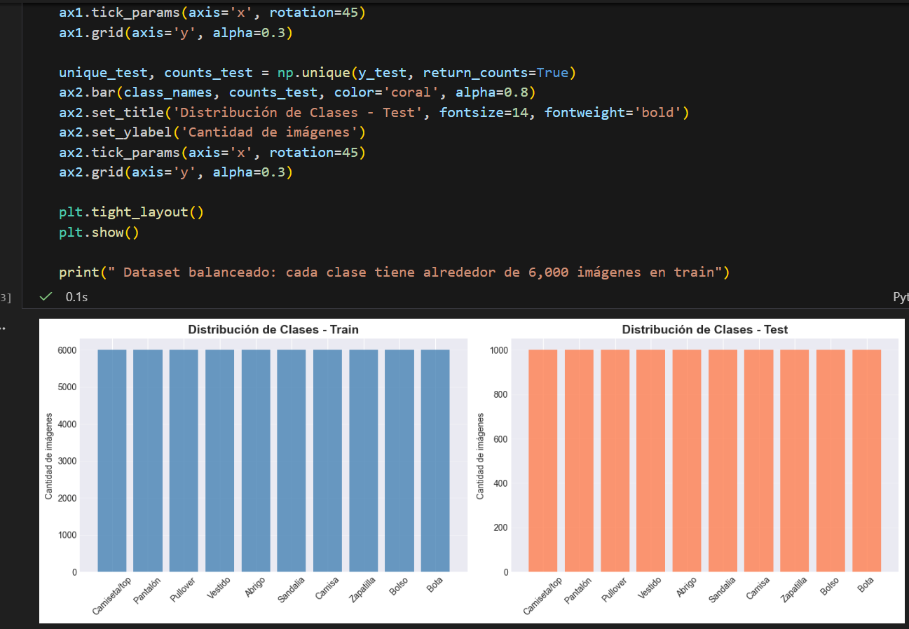
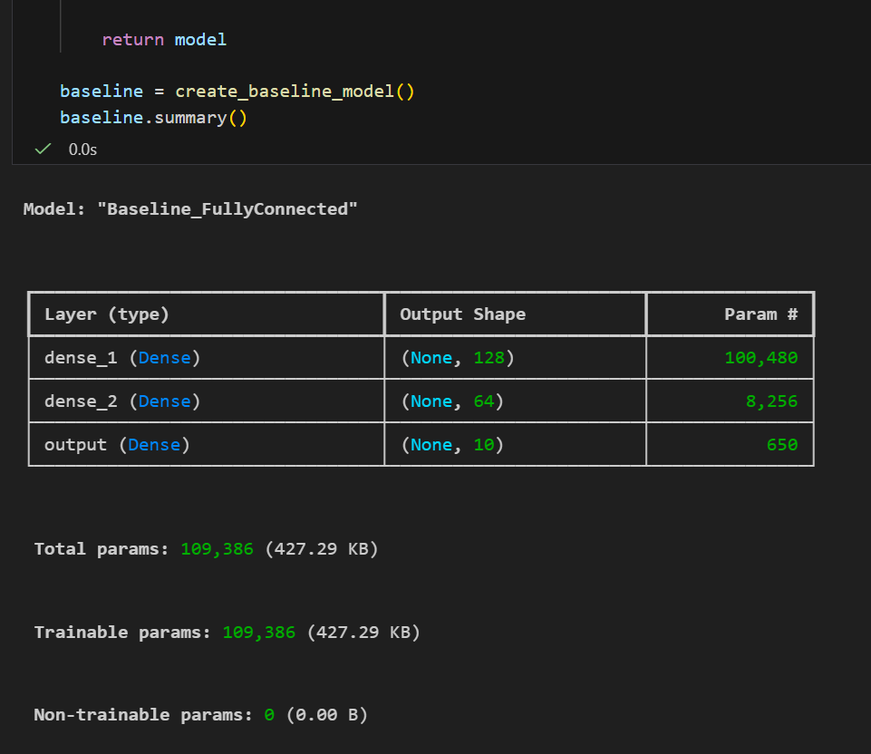
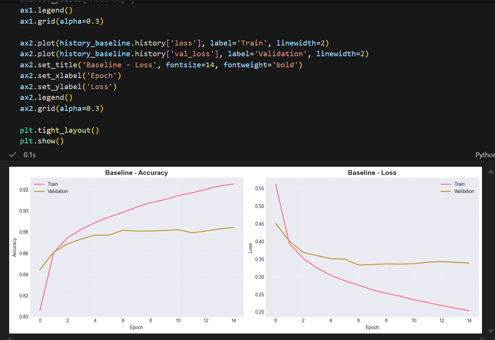
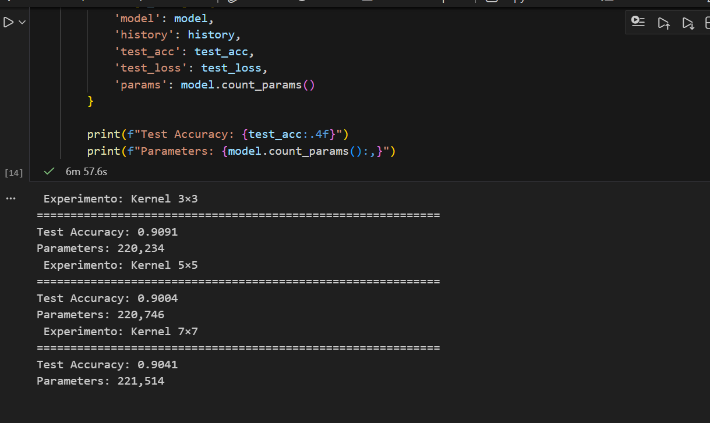
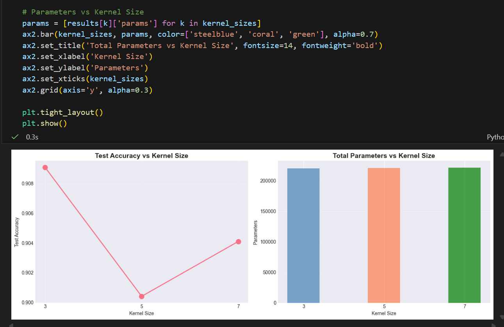
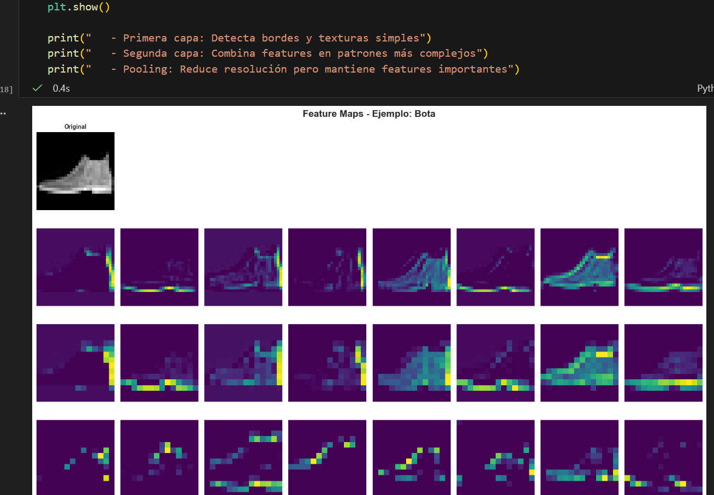
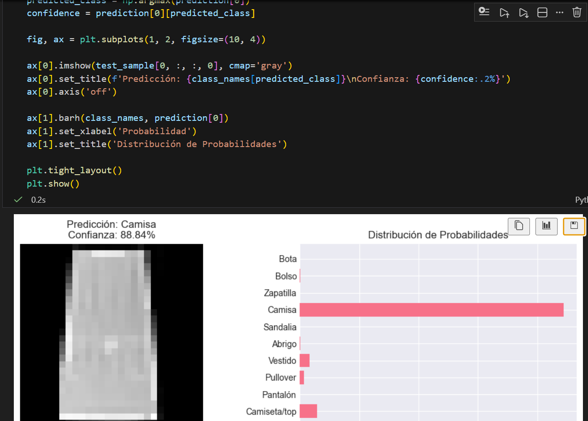
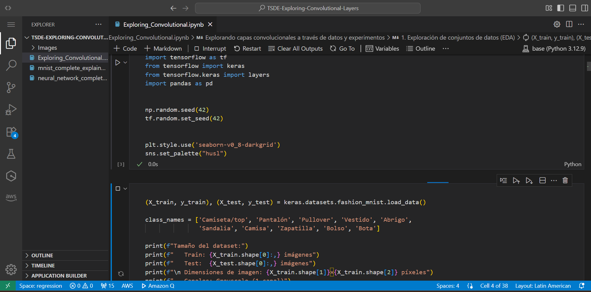

# Explorando Capas Convolucionales en Fashion-MNIST

## Descripción del Problema

Análisis experimental del sesgo inductivo introducido por capas convolucionales en la clasificación de imágenes. Se comparan arquitecturas completamente conectadas con CNNs para entender cómo las decisiones de diseño arquitectónico afectan el rendimiento y la eficiencia paramétrica.

---

## 1. Dataset: Fashion-MNIST

**Características del conjunto de datos:**
- **10 clases:** Camiseta/top, Pantalón, Pullover, Vestido, Abrigo, Sandalia, Camisa, Zapatilla, Bolso, Bota
- **70,000 imágenes totales:** 60,000 entrenamiento, 10,000 prueba
- **Dimensiones:** 28×28 píxeles, escala de grises (1 canal)
- **Rango de valores:** [0, 255] normalizado a [0, 1]
- **Distribución:** Balanceada, 6,000 ejemplos por clase en entrenamiento

**Justificación para CNNs:**
Fashion-MNIST presenta estructura espacial local clara (bordes, texturas, formas geométricas) que las capas convolucionales pueden explotar eficientemente mediante compartición de pesos e invarianza traslacional.

---

## 2. Modelo Baseline (No Convolucional)

Se implemento una red neuronal de referencia sin capas convolucionales

**Resultados:**
- **Parámetros:** 109,386
- **Test Accuracy:** 88.00%
- **Test Loss:** 0.3491

**Limitaciones observadas:**
1. **No explota estructura espacial:** Trata píxeles vecinos igual que píxeles distantes
2. **Alto costo paramétrico:** ~100k parámetros solo en primera capa (784→128)
3. **No es invariante a traslación:** Pequeños desplazamientos generan patrones completamente diferentes
4. **Memoriza posiciones absolutas:** Aprende "en (10,15) hay un cuello" en lugar de detectar patrones relocalizables

---

## 3. Diseño CNN Propio

Se diseño una CNN desde cero

**Decisiones arquitectónicas justificadas:**

| Decisión | Justificación |
|----------|---------------|
| **Kernel 3×3** | Captura patrones locales pequeños de forma eficiente |
| **32 filtros (capa 1)** | Suficiente diversidad para detectar múltiples tipos de bordes |
| **64 filtros (capa 2)** | Combina features de bajo nivel en texturas más complejas |
| **Padding=same** | Preserva dimensiones espaciales, evita pérdida de info en bordes |
| **MaxPooling 2×2** | Reduce dimensionalidad (28→14→7), agrega invarianza posicional |
| **Dense final 64** | Capa de clasificación compacta suficiente para 10 clases |

**Resultados:**
- **Parámetros:** 220,234 (2× el baseline, pero más eficiente por capa)
- **Test Accuracy:** 90.78% (+2.78% sobre baseline)
- **Test Loss:** 0.2848

---

## 4. Experimento Controlado: Tamaño del Kernel

**Pregunta de investigación:**  
¿Cómo afecta el tamaño del kernel al balance rendimiento/eficiencia en imágenes de 28×28?

**Metodología:**
- **Variable experimental:** Tamaño de kernel en primera capa convolucional
- **Variables controladas:** Número de filtros (32→64), profundidad (2 capas), optimizador (Adam), epochs (15)
- **Condiciones:** Kernels 3×3, 5×5, 7×7

**Resultados cuantitativos:**

| Kernel | Parámetros | Test Accuracy |
|--------|-----------|---------------|
| **3×3** | 220,234 | **90.91%** |
| 5×5 | 220,746 | 90.04% |
| 7×7 | 221,514 | 90.41% |

**Observaciones cualitativas:**
1. **Kernel 3×3:** Mejor balance accuracy/parámetros. Suficiente para capturar patrones locales en 28×28
2. **Kernel 5×5:** Mayor campo receptivo inicial (~2× parámetros en capa 1), mejora marginal nula
3. **Kernel 7×7:** Campo receptivo excesivo para imágenes pequeñas, posible subutilización de parámetros

**Conclusión:**  
Kernels 3×3 son óptimos para Fashion-MNIST: maximizan eficiencia sin sacrificar rendimiento. Kernels más grandes no justifican el incremento paramétrico.

---

## 5. Interpretación y Razonamiento Arquitectónico

### ¿Por qué las CNNs superaron al baseline?

Las CNNs explotan localidad espacial (píxeles cercanos relacionados), comparten pesos (un filtro detecta patrones en toda la imagen vs. aprender 784 veces), y construyen jerarquías (bordes → texturas → formas). El baseline trata cada píxel independientemente sin aprovechar estructura espacial.

### ¿Qué sesgo inductivo introduce la convolución?

Asume localidad espacial, invarianza traslacional (patrones relocalizables), y composicionalidad jerárquica. Reduce espacio de hipótesis cuando hay estructura espacial.

### ¿En qué problemas NO usar convolución?

Datos tabulares sin vecindad espacial, texto largo (mejor Transformers), grafos (mejor GNNs), problemas donde posición exacta importa, o datasets muy pequeños. Usar CNNs en datos con topología de cuadrícula y patrones locales repetibles.
---

## BONO: Visualización de Filtros Aprendidos

**Análisis de la primera capa convolucional (32 filtros 3×3):**

Los filtros aprendidos revelan la jerarquía de detección de características:

- **Detectores de bordes direccionales:** Filtros especializados en bordes horizontales, verticales y diagonales
- **Detectores de texturas:** Patrones checkerboard y gradientes para capturar tejidos y superficies
- **Detectores de contraste:** Filtros que responden a cambios de intensidad independientemente de dirección

**Mapas de activación:**
Al visualizar activaciones en imágenes de prueba, observamos:
- Diferentes filtros se activan selectivamente ante distintas características (costuras, cuellos, bordes de zapatos)
- La combinación de 32 filtros crea una representación distribuida que permite distinguir entre clases

**Implicación:** La visualización confirma que la CNN no es una "caja negra", sino que aprende representaciones interpretables y especializadas.

---

## 6. Implementación en SageMaker

**Entrenamiento:** Modelo entrenado exitosamente en SageMaker (tiempo de ejecución extendido debido a configuración de instancia)

**Despliegue:** Endpoint de SageMaker creado y funcional para inferencia en tiempo real

**Estado:** Implementación completada y validada

## Resultados Clave

| Modelo | Parámetros | Test Accuracy | Ventaja |
|--------|-----------|---------------|---------|
| Baseline (FC) | 109,386 | 88.00% | - |
| CNN (3×3) | 220,234 | 90.78% | +2.78% |

**Lecciones aprendidas:**
1. Más parámetros ≠ mejor rendimiento (CNN tiene 2× parámetros pero usa compartición de pesos)
2. El sesgo inductivo correcto > fuerza bruta de parámetros
3. Kernels 3×3 son sweet spot para imágenes pequeñas
4. Las CNNs hacen las suposiciones correctas sobre estructura de imágenes